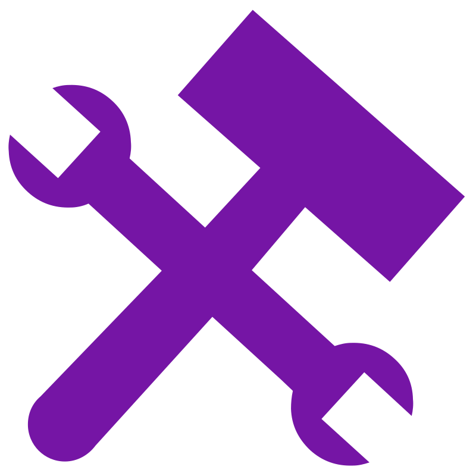

## I am Front-end developer

###  About me info:

I'm an enthusiastic and detail-oriented Frontend Software Engineer  with existing team experience, seeking an entry-level position with Company to use my skills in coding (acquired during my studies at IT courses "GeekHub" and supported by independent study of the JavaScript programming language on various educational resources), troubleshooting complex problems, and assisting in the timely completion of projects.

 

---

###  Technologies:

              

---

###  Instruments:

  

---

###  Social networks:

     

---

###  How to contact me:  

---

###  GitHub statistics:

<table>
  <tr>
    <td>
      
    </td>
    <td>
      
    </td>
  </tr>
</table>

